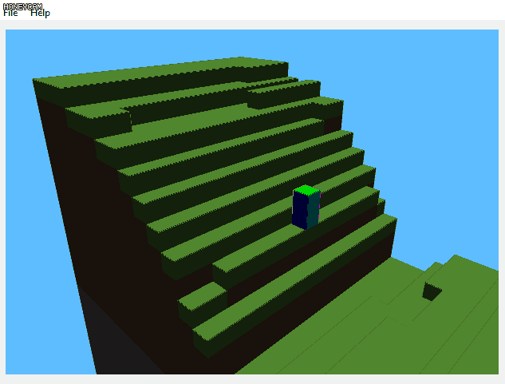

# MiniMineCraft
This project is the final assignment of CIS-560 Computer Graphics(_it is still under progress_). The project is based on OpenGL and Qt. Some features like procedural terrain, collision detection, gravity and ray-casting were implemented.
## Update_1 Shadow Mapping and Skybox
Two new features added.
### Shadow Mapping
For shadow mapping, I used two path to achieve it. In the first path, I rendered the depth buffer from the light. In the second path, I rendered the world and tested the depth of each pixel against the previous value in the depth buffer. If the new pixel is farther than the old pixel from the perspective of the light source, then it is in the shadow hence will be dimmed.

### Skybox
For the skybox part, I used the OpenGL cube map to achieve it.

## General Movement and Procedural Terrain
This part shows some general movements like walking and jumping. Notice when the character move off a stair, it automatically falls. Also it shows how the procedural terrain are generated. When the character approaches the border of the current "chunk", new "chunk" will be generated.

## First Person View
In first person view, the movement is similar to a general fps game, where "WASD" controls movement, "space" controls jumping and mouse controls viewing direction(and add/remove blocks).

## Collision Detection
The collision detection in this project does not only prevent the character moves in to a "collider" but also apply a repositioning method to allow the character "slide" along the surface of the "collider" when the velocity contributes to the movement along that surface. When performing collision detection, 12 rays will be cast from all 12 vertices of the bounding box of the character to perform ray-box intersection check. The nearest return position will be used to decide where the character should be. To implement the "slide" feature mentioned previously, the collision detection method will also return on which face of the box the collision happened. Given this information, we can place the character at a new position, making it seems like sliding along the surface.

## Add and Remove Blocks
When adding/removing blocks from the terrain, a ray will be cast from the (first-person-view)camera towards the viewing direction. The ray will be tested against all boxes within a 5x5x5 boundary around the character. In the case of adding blocks, the farthest empty box will be used and in the case of removing blocks, the nearest non-empty box will be used.

